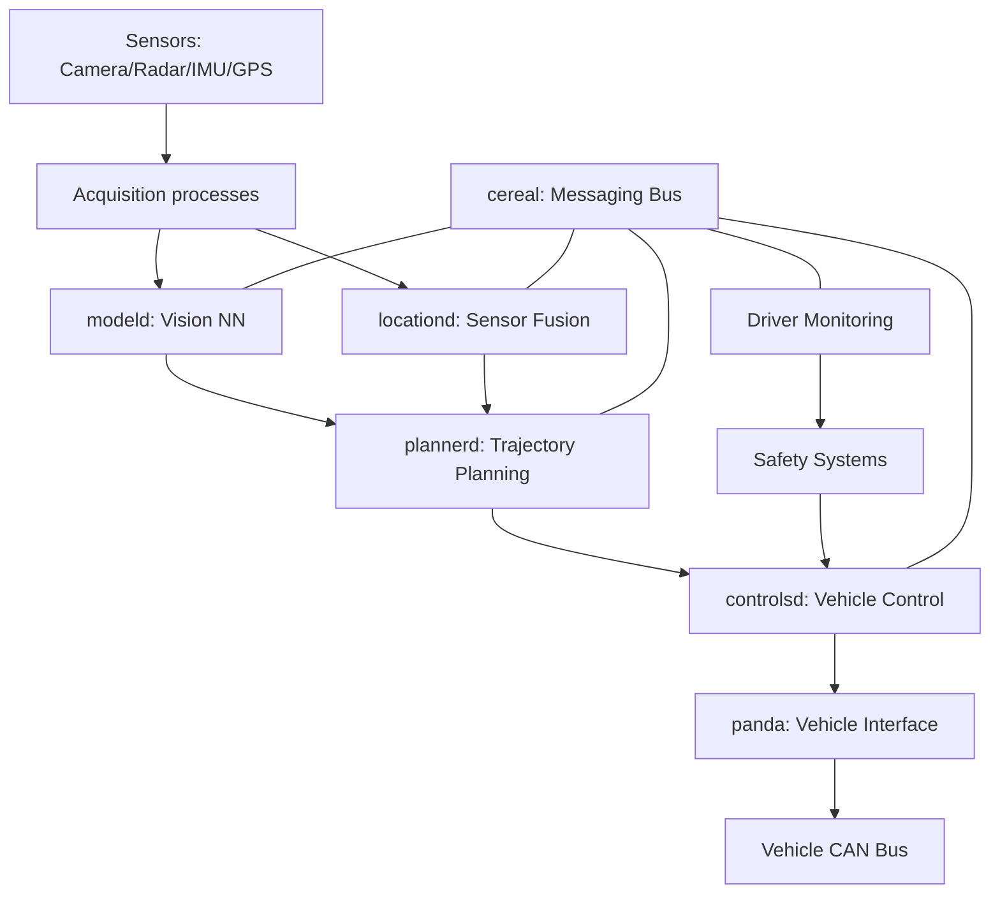

# openpilot Technical Overview

This document provides a technical overview of the openpilot autonomous driving system, its components, and how they work together. Use this as a map to navigate the codebase and understand its key functionalities.

## What is openpilot?

openpilot is an open-source driver assistance system that provides:
- Adaptive Cruise Control (ACC)
- Automated Lane Centering (ALC)
- Driver monitoring
- Support for 300+ production vehicles

The system runs on comma hardware (primarily comma 3X) connected to the vehicle's CAN bus via a car-specific harness.

## System Architecture

### Core Components



### Key Subsystems

#### 1. Messaging (`cereal/`)
- Purpose: Inter-process communication and logging
- Key files:
  - `cereal/log.capnp`: Message definitions
  - `cereal/services.py`: Service definitions
  - `cereal/messaging/`: Implementation
- Usage: `messaging.PubMaster`/`SubMaster` for publish/subscribe

#### 2. Vehicle Interface (`panda/`)
- Hardware interface (CAN/CAN-FD)
- Safety enforcement
- Directory structure:
  - `board/`: STM32 firmware
  - `python/`: Python interface library
  - `tests/`: Safety and functionality tests

#### 3. Vehicle Definitions (`opendbc/`)
- CAN signal definitions (DBC files)
- Safety model implementations
- Per-vehicle configurations

#### 4. Autonomy Stack (`selfdrive/`)
Main processes:
- `modeld/`: Neural network inference
  - Vision models
  - Object detection
  - Path prediction
- `locationd/`: Localization
  - Sensor fusion
  - GPS/INS integration
- `controlsd/`: Vehicle control
  - Lateral control (steering)
  - Longitudinal control (speed)
- `plannerd/`: Path planning
  - Trajectory generation
  - Speed planning
- `monitoring/`: Driver monitoring
  - Face detection/tracking
  - Attention monitoring
- `ui/`: User interface
  - On-device display
  - User controls/settings

#### 5. Common Utilities (`common/`)
Shared libraries and helpers:
- `params.py`: Parameter storage
- `realtime.py`: Timing utilities
- `swaglog.py`: Logging
- Various math/conversion utilities

#### 6. Developer Tools (`tools/`)
Development utilities:
- `replay/`: Log replay
- `sim/`: Simulation environment
- `plotjuggler/`: Data visualization
- Setup and testing scripts

## Data Flow

1. **Sensor Data Acquisition**
   - Cameras → Image processing
   - CAN bus → Signal decoding
   - IMU/GPS → Sensor fusion

2. **Perception & Planning**
   - `modeld`: Neural net inference
   - `locationd`: Position/state estimation
   - `plannerd`: Path/speed planning

3. **Control & Actuation**
   - `controlsd`: Command generation
   - `pandad`: Hardware interface
   - Safety checks & driver monitoring

4. **Logging & Monitoring**
   - All subsystems log via cereal
   - Driver monitoring runs parallel
   - Data optionally uploaded to comma.ai

## Safety Architecture

### Safety Model
- ISO26262 guidelines
- Driver must maintain control
- Actuator limits enforced
- Detailed in `docs/SAFETY.md`

### Implementation
1. **Hardware Level** (`panda/`)
   - Enforces torque limits
   - Monitors message rates
   - Checks signal validity

2. **Software Level**
   - Driver monitoring
   - Redundant checks
   - Fault detection

3. **Testing**
   - CI regression tests
   - Hardware-in-loop testing
   - Safety model verification

## Development

### Building & Testing
- Build system: SCons
- Test frameworks in each component
- CI via GitHub Actions

### Key Development Files
- `SConstruct`: Build configuration
- `pyproject.toml`: Python packaging
- `Jenkinsfile`: CI/CD pipeline

### Common Tasks
1. Running openpilot:
   ```bash
   # Quick start
   bash <(curl -fsSL openpilot.comma.ai)
   ```

2. Development setup:
   ```bash
   # Install dependencies
   tools/ubuntu_setup.sh  # or mac_setup.sh

   # Build
   scons -u -j$(nproc)
   ```

3. Testing:
   ```bash
   # Run tests
   python -m pytest

   # Run specific subsystem tests
   python -m pytest selfdrive/car/tests/
   ```

## Useful Resources

### Documentation
- `docs/CARS.md`: Supported vehicles
- `docs/SAFETY.md`: Safety model details
- `docs/CONTRIBUTING.md`: Contribution guide

### Code Navigation
Start with:
1. `selfdrive/manager.py`: Process management
2. `selfdrive/controls/`: Control logic
3. `selfdrive/modeld/`: Perception system
4. `cereal/log.capnp`: Message definitions

### Getting Help
- GitHub Issues
- Discord community
- Wiki documentation

## Appendix

### Glossary
- ACC: Adaptive Cruise Control
- ALC: Automated Lane Centering
- DBC: CAN bus signal definition format
- NN: Neural Network

### Common Workflows
1. Adding car support:
   - Add DBC file
   - Implement safety model
   - Test on hardware

2. Model development:
   - Collect training data
   - Train using tools
   - Test in simulation

3. Testing changes:
   - Use replay tools
   - Run regression tests
   - Hardware validation